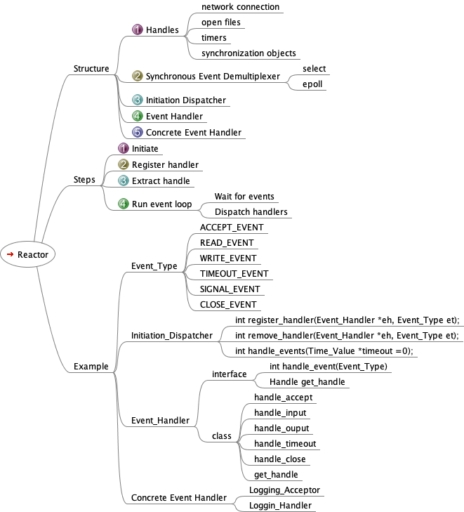

##########################################
Reactor Pattern
##########################################

.. include:: ../links.ref
.. include:: ../tags.ref
.. include:: ../abbrs.ref

============ =============================
**Abstract** Reactor Pattern
**Category** Learning note
**Authors**  Walter Fan
**Status**   WIP
**Updated**  |date|
============ =============================

.. |date| date::

.. contents::
   :local:

Overview
===========================================
Reactor 又称反应器模式

基于Reactor模式的IO框架一般包含如下几个组件:

* 句柄（事件源）：IO框架库要处理的对象，即IO事件，信号和定时事件。句柄的作用是，当内核检测到就绪事件时，它通过句柄来通知应用程序这一事件。Linux下IO事件对应文件描述符，信号事件则为相应的信号值。
* 事件多路分发器：由操作系统提供的I/O多路复用机制，如select和epoll。程序首先将其关心的句柄（事件源）及其事件注册到event demultiplexer上，当有事件到达时，event demultiplexer会发出通知“在已经注册的句柄集上，有一个或多个句柄的时事件已经就绪”，程序收到通知后，可以在非阻塞的情况下对事件进行处理。libevent使用结构体eventop对IO复用select,poll,epoll等进行封装，以统一接口来支持这些I/O多路复用机制，达到了对外隐藏底层系统机制的目的。
* Reactor：事件管理的接口，内部使用event demultiplexer注册，注销事件，并运行事件循环，当有事件进入“就绪”状态时，调用注册事件的回调函数处理事件。对于libevent的event_base结构体。
* Event Handler ：对应于libevent的event结构体。提供了一组接口，每个接口对应一种类型事件，供Reactor在相应事件发生时调用，执行相应的事件处理

library
=================

* libevent:

  - example: https://github.com/eddieh/libevent-echo-server/blob/master/echo-server.c

* libuv

  - example: https://github.com/eddieh/libuv-echo-server/blob/master/echo-server.c